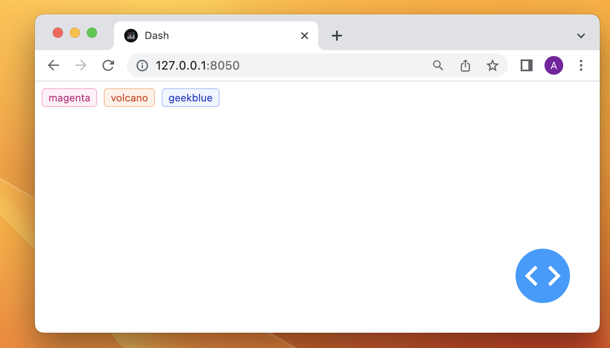

# Building a Customized Dash Component

Source: [Webinar: Converting React components to Dash components - YouTube](https://www.youtube.com/watch?v=wifoPPRgG_I)[Webinar: Converting React components to Dash components - YouTube](https://www.youtube.com/watch?v=wifoPPRgG_I)

1. First, you should install the required packages

```
$ pip install cookiecutter
$ pip install virtualenv
```

2. Run cookiecutter on the boilerplate repo, and enter required info [GitHub - plotly/dash-component-boilerplate: Get started creating your own Dash components here.](https://github.com/plotly/dash-component-boilerplate)

```
$ cookiecutter gh:plotly/dash-component-boilerplate
```

3. CD to the folder created and run the usage.py and see whether it is working

```
$ virtualenv venv
$ . venv/bin/activate
$ python usage.py
$ deactivate
```

4. - Install Ant Design `npm install antd --save`
   
   - Copy `AnyaTag.react.js` to the folder `src/lib/components`

5. Go to `src/lib/index.js`, import the newly added component. This file will be utilized to generrate relevant Python files.

```typescript
/* eslint-disable import/prefer-default-export */
import AnyaDash from './components/AnyaDash.react';
import AnyaTag from './components/AnyaTag.react';

export {
    AnyaDash,
    AnyaTag
};
```

6. cd to the main directory and say `dash-generate-components ./src/lib/components project_name -p package-info.json`  to generate relevant Python files. You should see the files generated under the folder `{Your Project Name}`

```
$ dash-generate-components ./src/lib/components project_name -p package-info.json
```

7. Build your code. This will generate the javascript files.

```
$ npm run build
```

8. Install the packages in the main directly

```
$ pip install .
```

9. Now you should be able to use to newly added components. This is an example. You should change the `project_name` to your own project name

```python
import project_name
from dash import Dash, html

app = Dash(__name__)

app.layout = html.Div(
    [
        project_name.AnyaTag(
            children=color,
            color=color
        ) for color in [
            'magenta', 'volcano', 'geekblue'
        ]
    ]
)

if __name__ == '__main__':
    app.run_server(debug=True)
```


